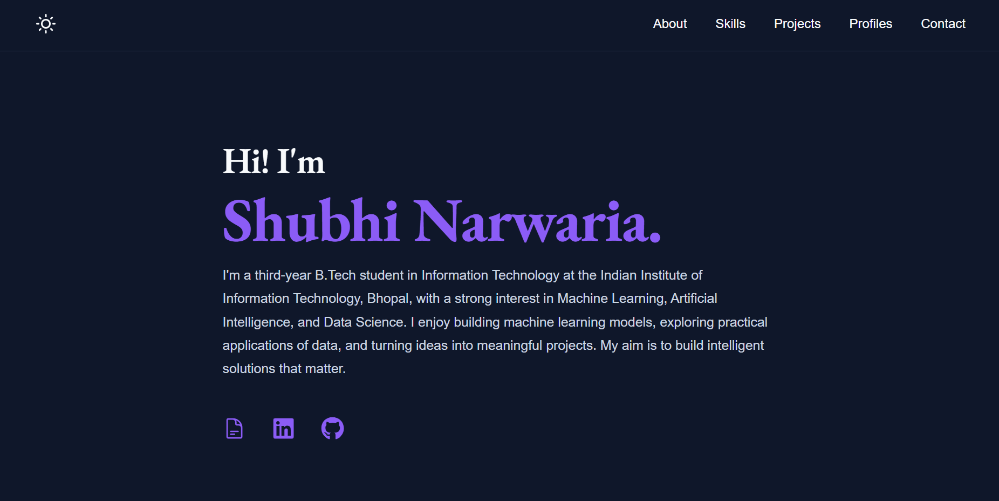

# Personal Portfolio

A responsive personal portfolio built with **React**, **HTML**, **CSS**, and **JavaScript** to showcase my skills, projects, education, coding profiles, and professional journey.

**Portfolio:** https://shubhi-123.github.io/portfolio

## Features

- Responsive design for desktop and mobile
- Dark & Light theme toggle
- Clean and minimal user interface
- Projects showcase with technology stack
- Coding profiles with direct links
- Language proficiency section
- Contact section with quick access links
- Deployed using GitHub Pages

## Built With

- React
- HTML5
- CSS3
- JavaScript (ES6+)
- CSS Modules
- React Icons

## 📬 Contact

- **Email:** shubhi.narwaria@gmail.com
- **LinkedIn:** https://www.linkedin.com/in/shubhi-narwaria/
- **GitHub:** https://github.com/shubhi-123

---

Built with curiosity.
